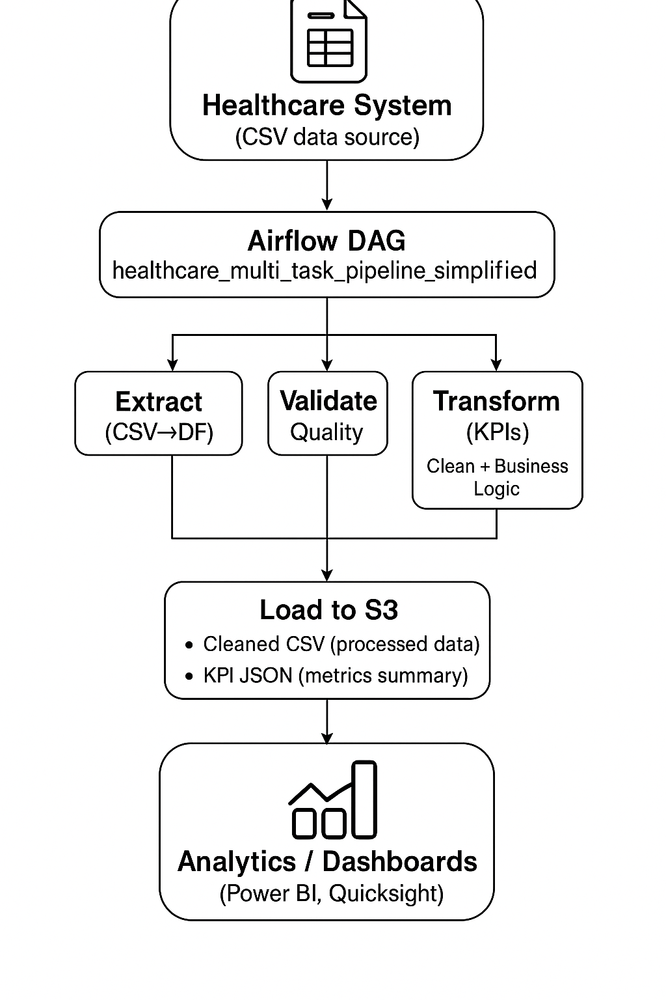

# Healthcare-ETL-Data-Pipeline

## Project Overview

This project automates the end-to-end data engineering workflow for healthcare data processing using Apache Airflow and Docker.
It extracts raw patient admission records, validates and cleans them, computes key healthcare KPIs (e.g., readmission rate, average length of stay), and stores both the cleaned data and KPI metrics in Amazon S3 for downstream analytics and reporting.
The pipeline simulates a production-grade healthcare data workflow — fully automated, validated, and containerized.

## Tech Stack

| Component                | Tool                           |
| ------------------------ | ------------------------------ |
| Orchestration            | **Apache Airflow**             |
| Containerization         | **Docker**                     |
| Programming Language     | **Python 3.9+**                |
| Cloud Storage            | **Amazon S3**                  |
| Scheduling               | **Airflow DAG (TaskFlow API)** |

## Setup Instructions (Local or Docker)

## 1.Clone Repository

git clone https://github.com/nyasa10/Healthcare-ETL-Data-Pipeline.git

cd healthcare_project

## 2.Start Airflow (Docker Compose)

docker-compose up -d

## 3.Place Raw Data

/opt/airflow/data/healthcare_dataset.csv

## 4.Access Airflow UI

http://localhost:8080

## 5.Trigger DAG

DAG ID: healthcare_multi_task_pipeline_simplified

Schedule: @daily

AWS Connection ID: aws_default

## Architecture Diagram

